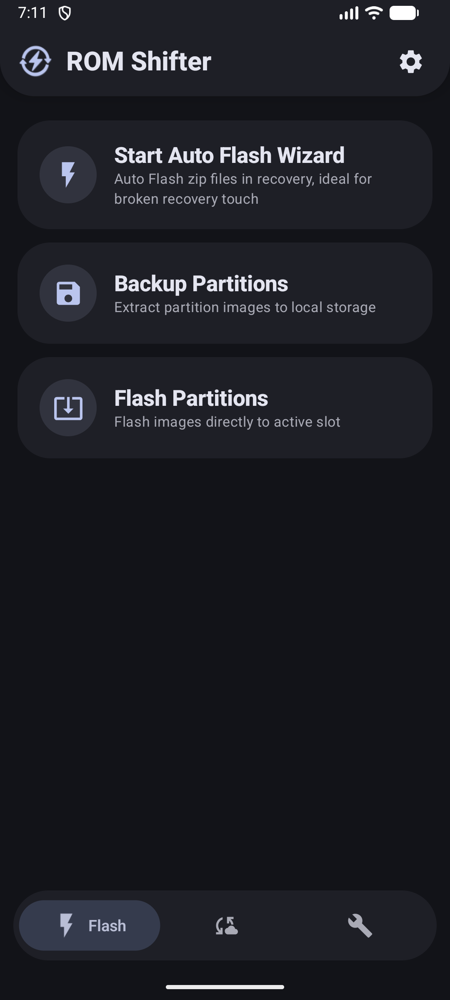
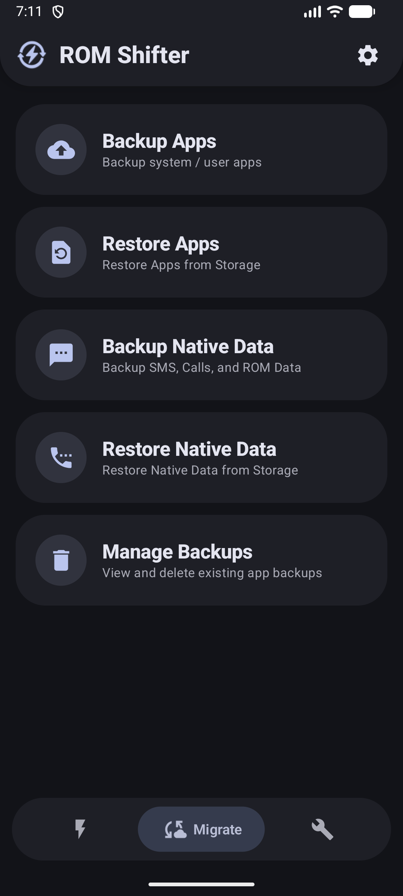
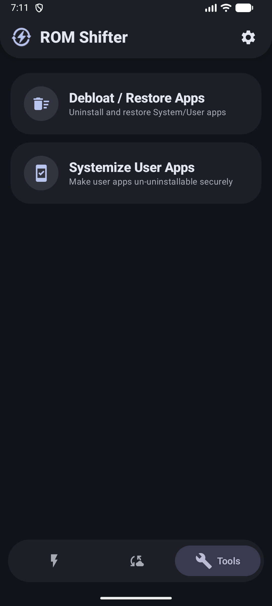

  
  <h1>⚡ROM Shifter App</h1>
  
<b>A unified, lightweight toolkit for all your ROM shifting and root-related tasks.</b>

 

* **ROM Shifter** is a an Android app built to make flashing, backing up, and migrating between custom ROMs as painless as possible. As well provides tools for some common things we do after switching to another ROM.

* *Note: This app is the native frontend successor to my original [ROM-Shifter Shell Script](https://github.com/ShivamXD6/ROM-Shifter-Script), which is archived now*

## 💡 Why ROM Shifter?

* There are plenty of great backup apps out there, and they all do their best, still i felt they are slow in backup restore. But honestly, I just wanted a single, unified, lightweight app that handles *everything* I actually need when hopping between ROMs without the unnecessary bloat.

* I didn't want three separate apps to back up my data, manage my partitions, and debloat apps etc. ROM Shifter combines a hyper-fast custom Shell backend engine with a clean Kotlin UI to do it all locally and quickly.

## ✨ Features

### ⚡ Flash

*Everything you need to flash, install, and restore device partitions.*

<b>Auto Flash Wizard (Click to Expand)</b>

*Automate the complete ROM flashing process directly from Android.*

* Configure the required wipes before flashing, including Dalvik, Cache, Data, Metadata, System, and
  Format Data.
* Select and arrange Firmware, ROM, G-Apps, Kernel, Recovery, and other flashable ZIPs in the order
  you want.
* Automatically creates the recovery flashing sequence using commonly recommended flashing
  practices.
* Warns you if a screen lock is enabled to help prevent FRP issues when booting into the new ROM.
* Choose what to boot into after flashing: System, Recovery, or Bootloader.
* Useful when recovery touch is not working or when you want to flash multiple ZIPs without manually
  interacting with recovery.

<b>Backup Partitions (Click to Expand)</b>

*Create raw `.img` backups of selected device partitions.*

* Search for and select the partitions you want to back up.
* Back up multiple partitions at the same time.
* Useful before flashing ROMs, kernels, recoveries, or making other low-level system changes.

<b>Flash / Restore Partitions (Click to Expand)</b>

*Flash a raw `.img` file directly to a selected partition.*

* Restore partition images created with ROM Shifter.
* Flash custom `.img` files to supported partitions.
* Useful for recovering or replacing individual partitions.

---

### 🔄 Migrate

*Everything you need to move your apps and personal or ROM data between ROMs.*

<b>Backup Apps (Click to Expand)</b>

*Backup user and system apps so they can be restored later.*

* Select individual apps or back up multiple apps at once.
* Choose exactly which components to back up, including:

  * APK / Split APKs
  * App Data
  * External Data
  * Media
  * OBB
  * Android ID
  * Granted Permissions
* All component, action, and filter controls are organized for quick and easy selection.
* Backup Benchmarks (Performed by users):

  * ~52.71 GB in 4m 14s (Internal Storage, UFS 4.0, 35 Apps) - Poco F6
  * ~15.60 GB in 1m 1s (Internal Storage, UFS 4.0, 5 Apps) - Poco X6 Pro
  * ~811.42 MB in 10s (Internal Storage, eMMC 5.1, 1 App) - realme 3 Pro
  * ~509 MB in 34s (SD Card, 2 Apps) - Redmi 10C
* Fully compresses base APKs and split APKs along with other backup components.

  * This results in backup sizes around 3% smaller for a single app and 15%+ smaller for bulk
    backups.
* Use Auto Select to automatically select apps that have already backup.
* Toggle between User Apps and System Apps to show or hide them.
* Useful before a clean ROM installation or when moving to another ROM.

> [!NOTE]
> App caches are not backed up because they are not required. Apps automatically recreate their
> caches when needed.

<b>Restore Apps (Click to Expand)</b>

*Restore apps and their backed-up data after installing a new ROM.*

* Select individual apps or restore multiple apps at once.
* Choose exactly which components to restore, including:

  * APK / Split APKs
  * App Data
  * External Data
  * Media
  * OBB
  * Android ID
  * Granted Permissions
* All component, action, and filter controls are organized for quick and easy selection.
* Restore Benchmarks (Performed by users):

  * ~52.77 GB in 7m 28s (Internal Storage, UFS 4.0, 312 Apps) - Poco X6 Pro
  * ~16.33 GB in 1m 41s (Internal Storage, UFS 3.1, 1 App) - realme GT NEO 3T
  * ~1.31 GB in 32s (Internal Storage, eMMC 5.1, 5 Apps) - realme 3 Pro
* Removes GMS transport files to prevent notification delays after restoration.
* Restores SELinux contexts to ensure apps such as Termux work correctly after restoration.
* Installs restored apps with Google Play Store as the installer source to prevent crashes in apps
  such as Airtel.
* Use Auto Select to automatically select apps that have not been restored yet.
* Toggle between User Apps and System Apps to show or hide them.

> [!NOTE]
> Backup and restore speeds automatically adapt to your device's hardware to deliver the best
> possible I/O performance across UFS, eMMC, and SD cards.

<b>Native Data Backup & Restore (Click to Expand)</b>

*Back up and restore important Android data that is not tied to individual apps.*

* Supports native backup and restore of:

  * SMS (including RCS)
  * Call Logs
  * Contacts
* Unlike other solutions, you do not need to set ROM Shifter as the default app to restore SMS, Call
  Logs, or Contacts.

<b>Manage Backups (Click to Expand)</b>

*Browse, manage, and delete existing app and native backups to keep your storage organized.*

* Use Auto Select to automatically select apps that have already been restored.
* Toggle between User Apps and System Apps to show or hide them.

---

### 🛠️ Tools

*Utilities for managing, customizing, and maintaining your rooted Android system.*

<b>Debloat / Restore Apps (Click to Expand)</b>

*Remove unwanted user or system apps from your device.*

* Select individual apps or multiple apps at once.
* Choose between User Apps and System Apps.
* Use Auto Select to automatically select apps that have already been backed up.
* Toggle User Apps or System Apps to show or hide them.
* Enable Restore to bring back previously debloated system apps.
* Enable Force Delete to permanently remove an app from its system directory.

  * ⚠️ This is destructive and cannot be restored through ROM Shifter.
* Useful for removing vendor bloatware and unnecessary system packages after installing a ROM.

<b>Systemize / De-Systemize (Click to Expand)</b>

*Move supported apps into or out of the Android system environment.*

* Requires the Mountify Module because directly moving apps into the system can be risky and is not
  supported on Dynamic Partitions.
* Shows only User Apps by default, since systemizing an existing System App is unnecessary.
* Supports De-Systemization when you no longer want a user app to remain installed as a system app.
* Useful when you want an app to become part of the system and no longer be removable like a normal
  user app.

  <h3> Rest Features explore it by yourself ;') </h3>

## 📱 Screenshots & Previews

  
<b>Tap to view Screenshots</b>

   
  

    
    
    
  

## 📥 Installation & Requirements

1. Your device must be rooted. Supported managers include **Magisk**, **KernelSU**, **APatch** and their forks.
2. Download the latest APK from the [Releases Tab](../../releases).
3. Open the app, grant Root permissions, and complete the setup wizard to pick your `Shifter`
   storage directory.

## 💖 Support the Project

ROM Shifter is open-source and entirely free. If this app saves your time, headaches, or saves your phone from a bootloop (jk XD), consider supporting the development!

* [Sponsor via GitHub](https://github.com/sponsors/ShivamXD6)
* [Donate via PayPal](https://paypal.me/ShivamXD6)
* [Donate via UPI QR](https://i.ibb.co/5g4J2RXR/1f38d6d7-a8a2-4696-88e6-9cf503e0592c.png)
* **UPI (India):** `shivamashokdhage6@oksbi` or `shivam.dhage@superyes`

Every contribution helps keep the project alive and improved! Thank you! 😊

---

  Developed by <b>@ShivamXD6</b> and the <b>Build Bytes</b> Team. 
  <a href="https://t.me/buildbytes">Join Telegram Community</a> • <a href="https://www.youtube.com/@BuildBytesX">Subscribe on YouTube</a>

